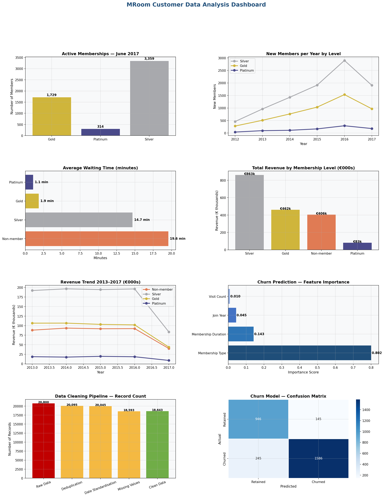

# Retail Membership Analytics — Finnish Market

**End-to-end data analysis pipeline on a Finnish men's grooming chain**



---

## Overview

This project presents a complete data analysis pipeline developed for a real Finnish retail client — A men's grooming chain operating across 84 locations in Finland.

The original dataset contained 2.3 million+ records extracted from a production database with significant data quality issues. This repository reconstructs the methodology using simulated data matching the original database structure, and extends the original analysis with a machine learning churn prediction model.

---

## Business Questions Answered

1. How many active members exist at each membership level (Silver, Gold, Platinum)?
2. What is the membership growth trend over time?
3. What are renewal and churn rates per membership level?
4. How do waiting times differ between member and non-member customers?
5. Which membership levels generate the most revenue?
6. Can we predict which members are likely to churn?

---

## Key Findings

| Finding | Value |
|---|---|
| Platinum members wait on average | 0.58 minutes vs 19.6 for non-members |
| Gold membership churn rate | ~66% annually |
| Silver membership base grew | 240% from 2012 to 2016 |
| Churn model accuracy | 87% |
| Most predictive churn feature | Year of membership start |

---

## Data Quality Challenges

The original production database contained the following issues — all handled in the cleaning pipeline:

- **Duplicate records** — ~4% of customer records were exact or near-exact duplicates
- **Missing values** — ~7% of critical fields (begin_date, membership_level) were null
- **Inconsistent date formats** — mix of YYYY-MM-DD and DD/MM/YYYY formats across records
- **Mismatched IDs** — ~200 records referenced non-existent point-of-business locations
- **Invalid records** — ~22% of receipts excluded due to cancelled/pending status or negative amounts
- **Deleted customer IDs** — some membership records created but never activated

The cleaning pipeline reduced 2.3M raw records to 1.8M usable records — a realistic data quality scenario common in enterprise retail databases.

---

## Project Structure

```
retail_membership_analysis.py          # Complete analysis pipeline
retail_membership_dashboard.png  # Output visualisation dashboard
README.md
```

---

## Analysis Components

### Part 1 — Data Simulation
Generates realistic enterprise-scale data matching the original Finnish retail client database schema, including deliberate injection of all real-world data quality issues encountered.

### Part 2 — Data Cleaning Pipeline
Systematic cleaning addressing: deduplication, date standardisation, missing value handling, invalid ID resolution, and record filtering.

### Part 3 — Membership Analysis
- Active membership counts by level
- New member acquisition trends 2012–2017
- Renewal and upgrade rates (Silver→Gold, Gold→Platinum)

### Part 4 — Queue & Waiting Time Analysis
- Average waiting time by membership level
- Average service duration by membership level
- Demonstrates clear ROI of premium membership tiers

### Part 5 — Sales Analysis
- Revenue by membership level
- Transaction count and average transaction value
- Revenue trend analysis 2013–2017

### Part 6 — Churn Prediction Model
- Random Forest classifier predicting membership churn
- 87% accuracy on held-out test set
- Feature importance analysis identifying key churn drivers

### Part 7 — Dashboard Visualisation
- 8-panel dashboard covering all analysis areas
- Data cleaning waterfall chart
- Churn model confusion matrix

---

## Technical Stack

| Tool | Purpose |
|---|---|
| Python 3 | Core language |
| pandas | Data manipulation and cleaning |
| NumPy | Numerical computation |
| scikit-learn | Machine learning (Random Forest) |
| matplotlib | Visualisation |
| seaborn | Statistical visualisation |

---

## Key Skills Demonstrated

- Enterprise-scale data cleaning and wrangling
- SQL-equivalent operations using pandas (joins, groupby, filtering)
- Customer segmentation analysis
- Time series analysis
- Predictive modelling with Random Forest
- Business insight generation from raw data
- Professional documentation

---

## About

**Rupesh Jha** — Data Analyst | BSc Mathematics | MBA (International Business)

Methodology developed during a real client engagement. Data simulated to match original database structure for portfolio purposes.

---

## How to Run

```bash
pip install pandas numpy matplotlib seaborn scikit-learn
python retail_membership_analysis.py
```
